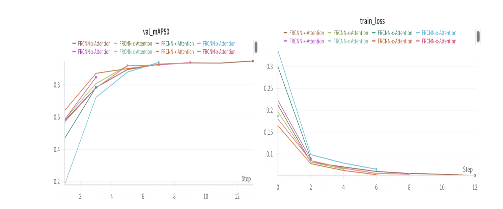
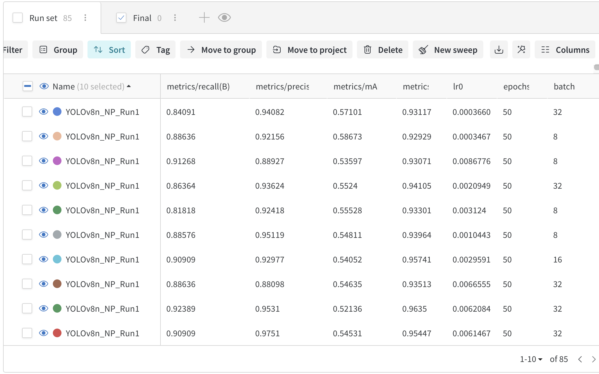

# Number_Plate_Detection

### Introduction
The automatic detection of vehicle number plates has become an increasingly important task in the domain of Computer Vision because of its application in traffic management, security monitoring  and law enforcing surveillance. This project investigates the effectiveness and efficiency of various object detection frameworks for identifying and localising number plates in digital photographs and videos.The study was conducted on architecture like Faster R-CNN and YOLO where the main objective was to beat the accuracy of pre-trained models with modified custom architecture. The project will explore 2 of the pre trained architecture (pre trained Faster R-CNN and YOLOv8 by Ultralytics) and 2 self developed hybrid architecture (custom Faster R-CNN and custom YOLO). All the results and metrics were logged into WandB for model comparison and further research. And the experiments conducted for the project including failed experiments were pushed to the github repository for code versioning and model deployment. The model was deployed on streamlit with YOLOv8 because of the highest accuracy and precision. 

### Data Pre-Processing
The dataset employed for the experiments was sourced from the Car License Plate Detection dataset available on Kaggle. It comprises approximately 433 images of vehicles with annotated number plates. The bounding box annotations are provided in the Pascal VOC format with XML annotations, which facilitates standardized evaluation and model training. For YOLO training the annotations are converted into YOLO supported file format. In the Pascal VOC format, bounding box annotations are specified using the coordinates of the top-left and bottom-right corners, represented as Xmin, Xmax, Ymin, Ymax. However, the YOLO (You Only Look Once) object detection framework requires annotations in a different format, where each bounding box is defined by its center coordinates (XCentre, YCentre,) along with its Width and Height.  Consequently, a conversion process is necessary to reformat the annotations from Pascal VOC to YOLO format. This involves computing the center point of the bounding box and its dimensions based on the original corner coordinates. 

Formula for YOLO Annotations //// 
XCentre = (Xmin + Xmax) / 2 //// 
YCentre = (Ymin + Ymax) / 2 //// 
Height = (Ymax - Ymin) ////
Width = (Xmax - Xmin)

### Architecture
The models will be discussed in the essay as follows :

Baseline model 1 ⇔ YOLOv8 by Ultralytics

Custom YOLO with CBAM attention

Baseline model 2 ⇔ Faster R-CNN

Custom Faster R-CNN

### Model
To achieve optimal number plate detection, this project initially employed YOLOv8 by Ultralytics and Faster R-CNN with a pre-trained ResNet-50 backbone as baseline models. The primary objective was to surpass the performance of these models by designing a modified architecture with enhanced detection capabilities. To this end, a series of experiments were conducted. These included the integration of Convolutional Block Attention Module (CBAM) mechanisms into YOLOv4, and the replacement of the YOLOv4 detection head with a novel YOLOv11 detection head. Additional experimentation involved incorporating spatial and channel attention modules into the neck of the architecture alongside the Feature Pyramid Network (FPN), although this yielded only marginal improvements in detection accuracy.
Subsequently, the project explored the integration of vision transformers, specifically the Swin Transformer, with Convolutional Neural Networks (CNNs) to enhance feature extraction in the backbone. After extensive experimentation, two of the most effective custom architectures were identified. These will be discussed in detail in the coursework, along with a comprehensive analysis of their performance metrics and accuracy results.

### Results
        

The best-performing configuration was achieved using the Adam optimizer with a learning rate of 0.0028544, under which the model attained a highest mAP@50 score of 0.96759. This configuration also resulted in a strong class-wise performance, with a precision score of 0.96919 and a recall score of 0.93819, indicating a good balance between identifying true positives and minimizing false positives. In contrast, the worst-performing hyper parameter setup was observed using the SGD optimizer with a learning rate of 0.0002807, resulting in a significantly lower mAP@50 score of 0.83103 and recall score of 0.76757. This highlights the sensitivity of the model's performance to optimizer choice and learning rate, highlighting the importance of careful hyperparameter selection in object detection tasks.

### Conclusion
Throughout this project “Automatic Number Plate Recognition”, I gained a deeper understanding about advanced object detection techniques like YOLO and Faster RCNN. I improved my practical skills  by developing models based on previous architecture. From my study I learnt that modern pertained backbones are pre trained with millions of images and implementing attention mechanisms do not guarantee improvement unless the data demands extra focus. HIgh accuracy can be achieved from high quality dataset and careful tuning of hyper parameters.In future my experiments would extend with harder datasets like blurry and unclear images and improving the quality using SRGAN like architecture. I would then compare the model with the attention mechanism to validate my findings from this project. Again implementing an advanced OCR might do well for text extraction and detection.

Finally, The model was deployed using streamlit services. Streamlit is light and offers a easy to integrate interface for deployment unlike Flask which needs a greater level of understanding in web designing. But in the future the model can be deployed using cloud platforms. I have skipped containerisation using Docker for the coursework. Also I am planning to deploy the model with hardware like raspberry pi or Nvidia GPU for real time number plate detection so the model can be deployed in any of the traffic controlling check points which will be very helpful for traffic management and other services. These are the few things I would be focussing on in the near future.

This project was a great learning experience for me. I learned a lot about object detection techniques and saw how they can be applied in practical situations. It improved not only my technical knowledge but also my problem-solving, critical thinking, and project management skills. Although I made good progress, I realized there are still areas where I can improve. In the future, I plan to explore real-time detection systems and try detecting multiple classes of objects. Working on this project has given me the confidence to tackle more advanced deep learning projects and continue growing my skills. I'm excited to apply what I've learned for solving  bigger computer vision challenges ahead.

#### Reference
All the sources have been referenced in the written report.
